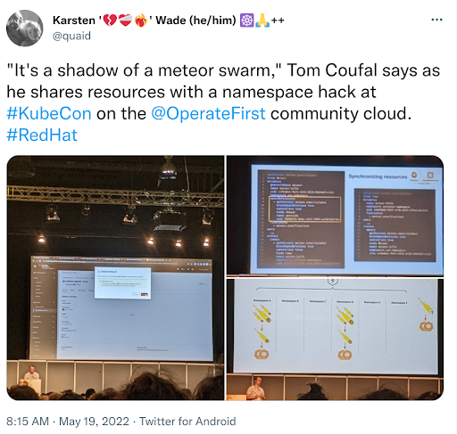

**This post from Operate First community lead Karsten Wade are his highlights from Valencia of discussions and activities of interest to the Operate First project**

## KubeCon Valencia EU 2022

**An Operate First community trip report**

_By Karsten Wade, Principal Community Architect_

### Overview

1. [Tom Coufal gave a talk](#toms-talk) at KubeCon and OpenShift Commons to a full house, impressing them with clever and valuable Kubernetes rule-hacking anti-patterns.
1. Where KubeCon LA 2021 was fact-finding and intel-gathering, this was a [soft-launch](#soft-launch) of the Operate First project to the cloud native community.
1. [Met with OKD](#okd-fedora-coreos) and Cluster API maintainers and members of the OKD working group to discuss bringing up clusters in community cloud running on Fedora CoreOS to create a build environment for OKD on FCOS releases.
1. Scoped k8s [SRE game](#sre-games) **Kombat** by Hilliary Lipsig, Principal SRE for OpenShift.
1. Discussed ["Open Operations"](#open-ops) as Fifth Open with folks.
Relationship building for Operate First [hard launch](#hard-launch) at KubeCon Detroit 2022, including with OpenShift Commons and OKD community leads, CNCF event organizers, and Kubernetes community leaders.
1. Discussions with Red Hatters causing these thoughts: How can we make Operate First useful and attractive to Hatters who want to increase their presence in the Open Source ecosystem? E.g. to increase role diversity, to increase and scale the influence of individuals and the organization, provide [career development opportunities](#oppos-hatters), and so forth.

### Details

#### Tom’s talk 

_Tom Coufal gave a talk at KubeCon and OpenShift Commons to a full house, impressing them with clever and valuable Kubernetes rule-hacking anti-patterns._

For OpenShift Commons, Tom gave a lighting talk, “Declarative GitHub org Management with Peribolos on Operate First” ([video](https://www.youtube.com/watch?v=Zjvn8VD4qTY)), expanding on how the Operate First community began using Peribolos as a collaboratively-run service in building out an Open SRE practice.

As of this writing, the video of Tom’s KubeCon talk “Implementing Anti-patterns: Kubernetes Cross-namespace Resource Ownership” has not been posted, instead I present you [this short Twitter thread](https://twitter.com/quaid/status/1527299504507977729), epitomized in this post:

#### Soft launch 

_Where KubeCon LA 2021 was fact-finding and intel-gathering, this was a soft-launch of Operate First project to the cloud native community._

By the Summer of 2021, within my first eight weeks working with the Operate First initiative, my fellow initiative co-leads decided we would make outreach to the cloud native community one of the cornerstones of our ecosystem strategy. We had already been adopting Kubernetes community tools and processes, for example, and knew we could provide a great value to everyone if we could get to the point of offering community cloud onboarding for testing and proving for any CNCF project.

The CNCF projects fit as a priority audience in several important ways:

1. The Operate First project pragmatically chose to build using Kubernetes tools and community processes as a way to get a prototype community cloud running for testing and proving. In addition, we’ll be building up content around how to create cloud native applications to run in the community cloud, and having this cloud provide a similar experience and versioning as the upstream Kubernetes community makes the Operate First project attractive to developers.
2. Many Red Hat developers are working in these CNCF projects, so we’ll be able to directly help code that is important to Red Hat, while helping RH Engineers with the mindset shift around working in an Operate First environment.
3. Currently, one of the moe likely places for the convergence toward creating an all-Open Source cloud is within Kubernetes. (Another is OpenInfra, naturally.)

In October 2021 I attended KubeCon LA (my first CNCF event) to gather intel about how to approach the community and talk to the attendees.

What I found was a compatible, joinable community with many interesting problem spaces being worked that would benefit from an Operate First approach, and potentially from working with our community. I also connected with other Red Hatters, helping form some of the seeds of crossover internal/external collaborations. The shape of a plan for how to present and represent the Operate First project to a cloud native community began to form. Our initial updates to messaging also got a lot of use, with me explaining “Operate First” more than a hundred times, learning in real time what was working, what resonated, and what fell flat.

#### OKD, Fedora CoreOS, & Cluster API? Oh my 

_Met with OKD and Cluster API maintainers and members of the OKD working group to discuss bringing up clusters in community cloud running on Fedora CoreOS to create a Build environment for OKD on FCOS releases._

Attending my first KubeCon also gave me a chance to attend my first OpenShift Commons, and I easily identified the crossover potential with the Operate First project. When it comes to establishing and growing an SRE community of practice, OpenShift Commons members and their organizations are just the places we want our message to reach, for example.

One of the key discussions we lined up for this KubeCon was to meet with OKD maintainers and members of the OKD working group. Just as those discussions began informally at the end of the Commons day, Mike McCune joined us and brought the Cluster API perspective to things.

There will be more blog posts to come that detail this work, so this is just an overview of the effort and effects.

Working with members of the OKD working group and Red Hat Engineers from the OKD build team and the Fedora CoreOS Engineering team, we intend to bring up Fedora CoreOS-based clusters in the Operate First community cloud. This will function as a build environment for building up OKD from scratch. The result will be OKD images built entirely in the Operate First community cloud environment.

We expect there to be issues right away with the build as some OKD components may be pinned to or otherwise relying upon features from older parts of Fedora CoreOS. But because these issues will be visible in a public build space, we have better opportunities to work on them and find fixes that can go in an upstream location. At the very least, if we need to carry patches against Fedora CoreOS in OKD, it will be from within the Operate First project as cross-stream dependencies we are carrying ourselves. Then they stay on the roadmap as needing to be fixed either in OKD (to work against vanilla Fedora CoreOS) or perhaps in the CoreOS trees, as per the upstream first method.

#### SRE games 

_Scoped k8s SRE game `Kombat` by Hilliary Lipsig, Principal SRE for OpenShift._

One of the great features of attending an event with other Red Hatters is finding potential connections between our work. In the case of [Hilliary Lipsig](https://twitter.com/int2caffeinate), Principal SRE for OpenShift, this turned out to be a very interesting SRE game she has created called **Kombat**.

Kombat is a team-based challenge of repairing a Kubernetes-based cloud environment that has been broken “accidentally” by a customer. With one team representing the customer, the other players are divided into two parts of an incident response team – one interacting with the customer, the other deep in troubleshooting and solving problems while keeping in communication with the customer-facing team.

When we heard about this game, all of us Operate First community members perked-up our ears with the same idea:  What if we ran this as a fun competition by the Operate First community?

There are a lot of ways I can imagine this coming together, but we’re going to start first with a discussion on the [mailing list](https://lists.operate-first.cloud/archives/list/community@lists.operate-first.cloud/) and [Slack group](https://join.slack.com/t/operatefirst/shared_invite/zt-o2gn4wn8-O39g7sthTAuPCvaCNRnLww). I’m inviting Hilliary to join that discussion so we can see who is interested in helping. With enough people interested in helping, we can all collaborate with Hilliary on making the first game happen, then see where it goes from there!

#### Open Operations? 

_Discussing "Open Operations" as Fifth Open with folks_

There is more coming on the topic of Open Operations after our session at OpenInfra Summit in Berlin on 09 June, “[Open Operations: the Fifth Open paradigm](https://openinfra.dev/summit-schedule#date=2022-06-09&track=382&speakers=16687&view=calendar)”. This is another area of convergence with communities who are interested in defining and building Open infrastructure for Open Source projects, such as the [Sovereign Cloud Stack](https://scs.community).

During Kubecon I was in a discussion with Aeva Black, who’s considerable background includes being part of the creation of the OpenStack community and helping define and teach about the Four Opens. I decided to preview for her the “controversial” approach we are taking at OpenInfra Summit in Berlin in our birds of a feather (BOF) session on Thursday 09 June.

In short, we are proposing adding “Open Operations” as a fifth Open to the [OpenInfra Four Opens](https://openinfra.dev/four-opens/), the argument being it is needed to enable the other Opens to be more effective and is effectively presumed within the Four Opens to exist. The clearest argument is around Open Development, where having a fully-transparent infrastructure and operations can be essential to the development of web/cloud services, as it is arguably part of the toolchain for enabling the source code to function.

For her part, Aeva was skeptical about messing with a good and symmetrical list, knowing how the foundation of a concept can be memorized and transmitted more easily with a memorable list.

So maybe, I thought, there is a value in having Open Operations be an unofficial non-member of the list, standing out on the side a bit because we’re still inside of the paradigm shift and a new meaningful list hasn’t emerged?

I’m looking forward to hearing any pushback, concerns, and confusion from folks at the BOF. When I get into that topic in my OpenInfra Summit trip report, we’ll see where the discussion has progressed.

#### Hard launch - KubeCon Detroit 2022 

_Relationship building for Operate First hard launch at KubeCon Detroit 2022, including with OpenShift Commons and OKD community leads, CNCF event organizers, and Kubernetes community leaders._

Details still to come, but are planning an Operate First launch for [KubeCon Detroit 2022](https://events.linuxfoundation.org/kubecon-cloudnativecon-north-america/) (24 - 28 October)..

If you are interested in getting involved in the planning process (which may involve getting invited to help onsite at the event), add your name and idea to this issue in the Community SIG:  [https://github.com/operate-first/community/issues/199](https://github.com/operate-first/community/issues/199)

We’ll have more discussions in that issue, but brainstorming some ideas on the community mailing list will likely happen, too.

#### Diverse opportunities for Hatters 

_Discussions with Red Hatters causing these thoughts: How can we make Operate First useful and attractive to Hatters who want to increase their presence in the Open Source ecosystem? E.g. to increase role diversity, to increase and scale the influence of individuals and the organization, provide career development opportunities, and so forth._

Talking with some Red Hatters at KubeCon, it was clear there are always Hatters looking for opportunities to get involved in Open Source projects who don’t know where to start or what is useful for them and their careers.

The idea came up to have an internal campaign with a focus on role diversity and how to find a connection between diverse careers and activities in the Operate First project. Some may be opportunities to work with others right away, some may just be an idea ready for someone able to start up that aspect of the community.

I’m looking for a Hatter to work with on advancing this idea. I know of some good places to get started, but I’ll be more successful working with another person or small group to get this campaign going. Let me know if you’d like to do something with this idea!
