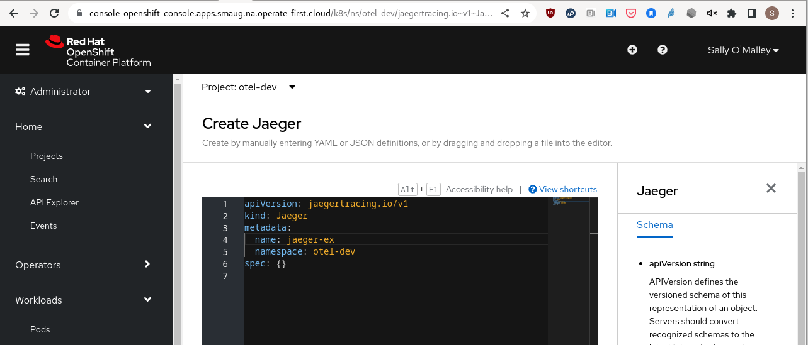
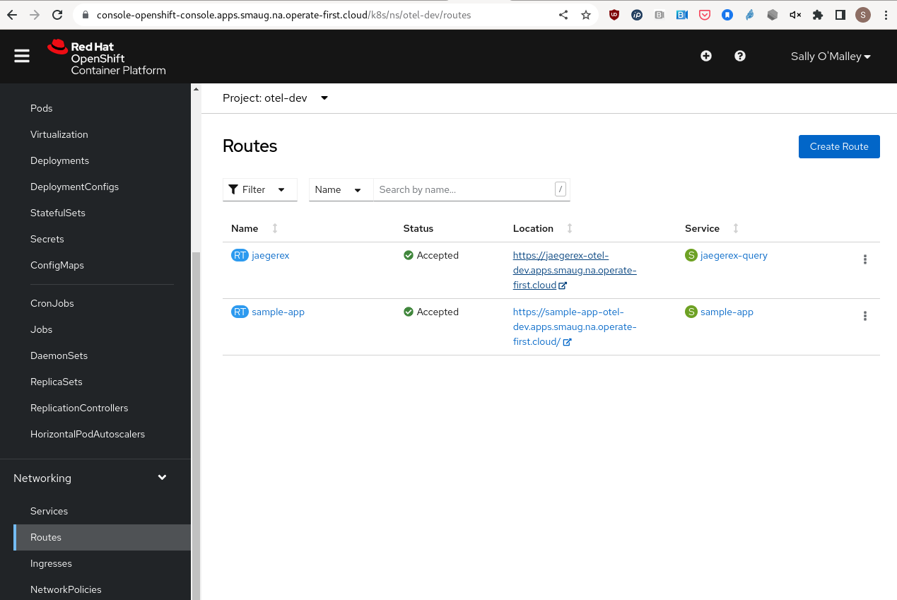
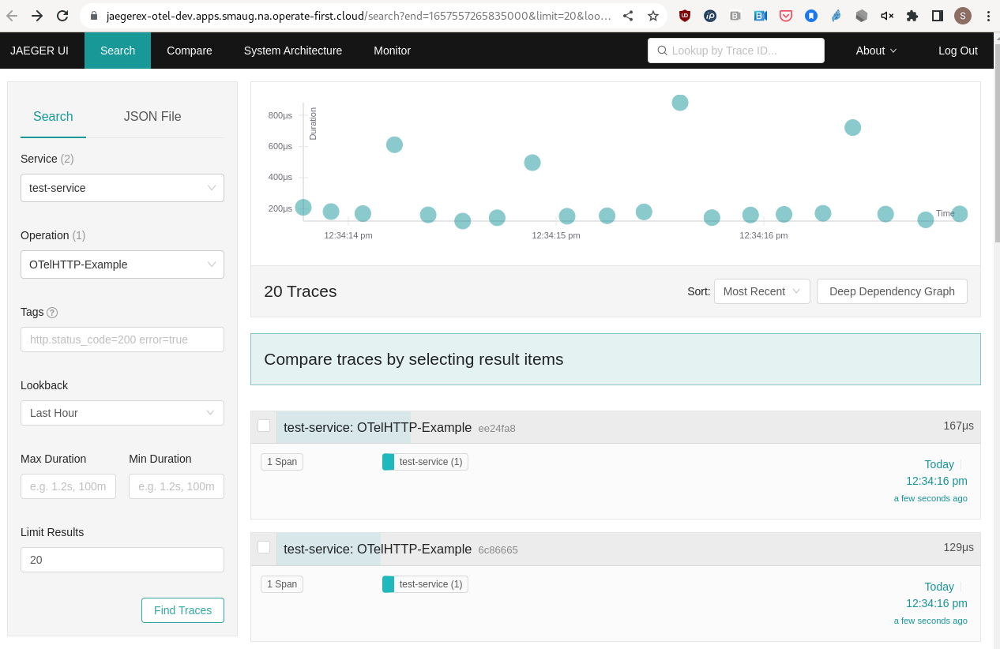
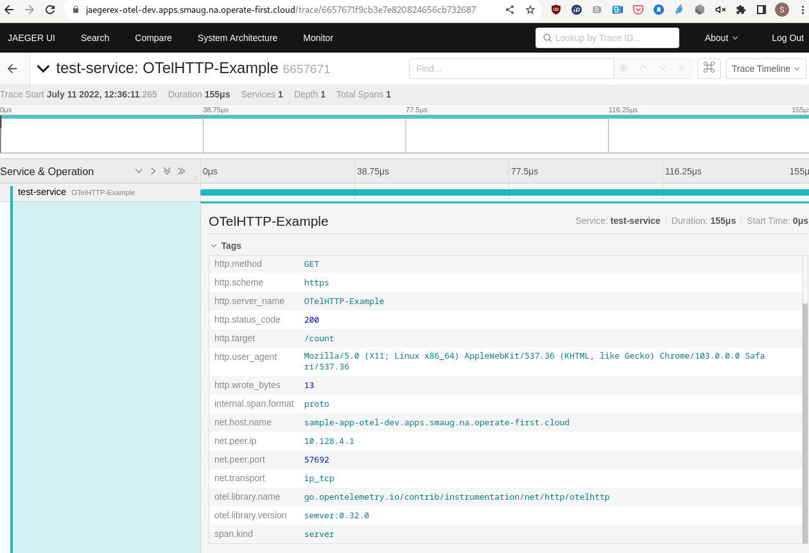

The [OpenTelemetry](https://opentelemetry.io/) project has been advancing cloud-native observability for the past few years.
This project is a collection of tools, APIs, and SDKs to instrument, generate, collect, and export telemetry data (metrics, logs, and traces).
With OpenTelemetry (OTLP), end-users and developers are empowered to choose a telemetry backend that suits their needs.
It is vendor neutral, open source, and is supported by industry leaders in the observability space.
Perhaps you've been planning to add OTLP instrumentation to your applications.
It is relatively straight-forward and usually involves a few lines of code.
The more complicated issue is how to collect, export, and visualize the generated data.
This post describes recent additions to the Operate First community cloud that have made it easy for users to collect and analyze OTLP.

To learn more about the Operate First [community cloud](https://www.operate-first.cloud/community-cloud/) and how you can access it, visit the [onboarding docs](https://www.operate-first.cloud/getting-started).
If, like me, you're a developer wishing to deploy your applications and perform testing in a production environment, you might start [here](https://www.operate-first.cloud/developer).
From there you can onboard your Kubernetes based cloud-native workloads with help from the Operate First community.

Recently, two Operators were deployed on the Operate First `Smaug` cluster that enable collection of OTLP data from any application.
The operators are `Red Hat Distributed Tracing Platform` and `Red Hat Distributed Tracing Data Collection`.
The former includes a Jaeger operator for visualizing OTLP data and the latter includes the OpenTelemetry operator that manages namespaced OpenTelemetryCollectors to collect OTLP.
These and many other Kubernetes Operators are available from the [Certified OpenShift Operators Hub](https://catalog.redhat.com/software/operators/explore).
This post describes how to connect your applications and workloads to these distributed tracing operators to reach your observability goals.
You might bring your instrumented applications to Operate First, or you might use this post to collect OTLP data from another K8s cluster.


### Table of Contents
* [Introduction](#introduction)
* [Red Hat Distributed Tracing Data Collection](#red-hat-distributed-tracing-data-collection)
* [Red Hat Distributed Tracing Platform](#red-hat-distributed-tracing-platform)
* [Example Application](#example-application)
* [Connecting to OpenTelemetry Collector](#connecting-to-opentelemetry-collector)
* [Connecting to Jaeger](#connecting-to-jaeger)
* [Visualizing Your Data](#visualizing-your-data)
* [Summary](#summary)

### Introduction

Let’s start with what this blog is _not_.
This post does not demonstrate how to instrument your applications to export OTLP.
It assumes you have an application that is already instrumented.
However, the [example application](https://github.com/sallyom/golang-ex.git) can be used as a guide for instrumenting a simple golang web server.
There are also many online resources to help you along your way.
Start with the [instrumentation docs](https://opentelemetry.io/docs/instrumentation/) for language-specific guides.
With only a few lines of code, your application will be exporting telemetry.
The interesting part is the collection and analysis of that data.
It is a core mission of the OpenTelemetry project to make instrumenting easy and universal, to uncouple instrumentation from data storage
and analysis.

### Red Hat Distributed Tracing Data Collection

The Red Hat Distributed Tracing Data Collection operator is an opinionated OpenTelemetry Collector Operator.
It is easy to install from the OperatorHub as an OpenShift administrator.
Once running, regular users can create its custom resources in their own projects.
The operator watches all namespaces in the `Smaug` cluster for namespaced custom resources `OpenTelemetryCollector` and `Instrumentation`.
In a cluster with this operator running, these resources can be accessed from the OpenShift console's left navigation menu `Installed Operators > <operator-name>`.

The presence of an OpenTelemetryCollector in a namespace (project) triggers the creation of several resources in that namespace including a deployment of the OpenTelemetry Collector.
In simple terms, all that is required to launch an OTLP collector in your namespace is the creation of an OpenTelemetryCollector.
This custom resource configures OTLP receivers and exporters. An OTLP collector is an intermediary that allows OTLP data to be funnelled to a variety of backends.
Traces, logs, and metrics can be exported from an application with a single OTLP collector.

The presence of an `Instrumentation` custom resource triggers the automatic instrumentation of an application.
This is available for a limited list of languages.
At this time Python, Java, and Ruby offer auto-instrumentation. For more information, visit the [automatic instrumentation docs](https://opentelemetry.io/docs/instrumentation/java/automatic/).

Visit the Red Hat Distributed Tracing Data Collection [documentation](https://catalog.redhat.com/software/operators/detail/615486a469cb9f1af5ba7421) and the OpenTelemetry Operator project on [GitHub](https://github.com/open-telemetry/opentelemetry-operator) for additional details and examples.

### Red Hat Distributed Tracing Platform

The Red Hat Distributed Tracing Platform is an opinionated Jaeger Operator.
This operator watches all namespaces in the `Smaug cluster` for any namespaced `Jaeger` custom resources.
The presence of a Jaeger in a project triggers the creation of several resources including a deployment of Jaeger along with a route to the Jaeger frontend.
In a cluster with this operator running, these resources can be accessed from the OpenShift console's left navigation menu `Installed Operators > <operator-name>`.

The example below creates an `AllInOne` instance of Jaeger that uses in-memory storage.
For production modes, visit the Red Hat Distributed Tracing Platform [documentation](https://catalog.redhat.com/software/operators/detail/5ec54a5c78e79e6a879fa271).
Jaeger is a tool to analyze traces.
There are many vendors and open source projects that offer backends for traces, logs, and metrics - all of which can be funnelled through a single OTLP collector.
The [OpenTelemetry Registry](https://opentelemetry.io/registry/) lists OTLP compatible tools.

### Example Application

For this blog, an [example golang application](https://github.com/sallyom/golang-ex/tree/master/opentelemetry-sample-app) is deployed in the Smaug cluster `otel-dev` project.
The application includes a simple web server, a service that exposes port 8080 of the web server pod, and a route that exposes the service. View the single yaml file [here](https://raw.githubusercontent.com/sallyom/golang-ex/master/opentelemetry-sample-app/sample-app.yaml).
To deploy this application in your own cluster, first create an `otel-dev` namespace or project (or, substitute `otel-dev` everywhere for your namespace), and then apply the sample-app yaml file.
Since Smaug is an OpenShift cluster, here we use the command-line tool `oc`.
However, `kubectl` can be substituted and used with any Kubernetes based cluster.

```bash
oc new-project otel-dev  // or kubectl create namespace otel-dev
oc apply -f opentelemetry-sample-app/sample-app.yaml
```

Two files are served by this application.
A [`Hello OpenShift`](https://sample-app-otel-dev.apps.smaug.na.operate-first.cloud/hello) page and a [counter](https://sample-app-otel-dev.apps.smaug.na.operate-first.cloud/count).
Visiting the pages creates trace spans that can be collected with the OpenTelemetry Collector and visualized with Jaeger.

> **Note:**
The example application hard-codes the [opentelemetry collector service name](https://github.com/sallyom/golang-ex/blob/eef199cce7dd20f37e8d09a7149754c112f8fcb2/hello_openshift.go#L81) `otelcol-collector.otel-dev.svc:4317`. `otelcol` is the name of the `OpenTelemetryCollector`.
Its presence in a project triggers the creation of a service with an internal address of `resource-name.namespace.svc:4317`. `4317` is the default GRPC collector port.
It is often appropriate to configure `localhost:4317`, whenever the application & collector share localhost.

### Connecting to OpenTelemetry Collector

Because the Smaug cluster is running the OpenTelemetry Operator, it is very easy to launch a collector in any namespace.
This is the OpenTelemetryCollector custom resource that was created in the `otel-dev` project, alongside the example application.

```yaml
apiVersion: v1
kind: ConfigMap
metadata:
  annotations:
    service.beta.openshift.io/inject-cabundle: "true"
  name: otelcol-cabundle
  namespace: otel-dev
---
apiVersion: opentelemetry.io/v1alpha1
kind: OpenTelemetryCollector
metadata:
  name: otelcol
  namespace: otel-dev
spec:
  config: |
    receivers:
      otlp:
        protocols:
          grpc:
          http:
    processors:
      batch:

    exporters:
      logging:
        loglevel: debug

      jaeger:
        endpoint: jaegerex-collector-headless.otel-dev.svc:14250
        tls:
          ca_file: "/etc/pki/ca-trust/source/service-ca/service-ca.crt"

    service:
      pipelines:
        traces:
          receivers: [otlp]
          processors: [batch]
          exporters: [logging,jaeger]
  mode: deployment
  resources: {}
  targetAllocator: {}
  volumeMounts:
  - mountPath: /etc/pki/ca-trust/source/service-ca
    name: cabundle-volume
  volumes:
  - configMap:
      name: otelcol-cabundle
    name: cabundle-volume
```

Notice the receivers are the default OTLP grpc and http values (left empty, the collector will use the defaults).
These are appropriate 99% of the time.
There are two exporters configured, `Logging` and `Jaeger`.
With the jaeger exporter, the `endpoint` is specified along with the `ca_file` that is mounted from the `otelcol-cabundle` configmap.
This configmap utilizes OpenShift's auto-certificate mechanism in which a configmap with the annotation `service.beta.openshift.io/inject-cabundle: "true"` will result in that configmap populated with a Certificate Authority valid for the cluster, to enable secure communication with the Jaeger pod.
The `mode` is also specified as a `deployment`.
Once the receivers and exporters are configured, all that's left to do is specify a service pipeline.
Here we've configured a `traces` pipeline.
Refer to the [OTLP Collector documentation](https://opentelemetry.io/docs/collector/) for more detailed explanations of its options.
That's it! Now the OTLP collector will be collecting trace data from any instrumented application that is running in the `otel-dev` namespace and that is configured to connect to the collector service address.

> **Note:**
The OpenTelemetryCollector is configured to connect to the Jaeger service at the default port `14250`.
Below, when creating a `Jaeger` instance, the resource name must match the name in the Jaeger service address listed in the collector.
Here it is `jaegerex` where the service address will be `jaegerex-collector-headless.otel-dev.svc:14250`.

### Connecting to Jaeger

Because the Smaug cluster is running the Jaeger Operator, it is easy to launch Jaeger in any namespace.
The Jaeger `All-In-One` is created in the otel-dev namespace by searching `API Explorer` for `Jaeger` then `Create Jaeger` under `Instances`.
Also, because the OpenTelemetry collector is already configured to export and connect to the Jaeger service, this is all that is required.
This Jaeger resource triggers the creation of everything required to visualize the trace data from the OTel collector running in the same project.



Similar to the OpenTelemetryCollector, a Jaeger can also be created from the command line.
Here is the definition for the simplest All-In-One resource:

**jaeger.yaml**

```yaml
apiVersion: jaegertracing.io/v1
kind: Jaeger
metadata:
  name: jaegerex
  namespace: otel-dev
```

```bash
oc apply -f jaeger.yaml
```

### Visualizing Your Data

Creation of a public route for the Jaeger frontend is triggered by the existence of a `Jaeger`.
All that is left to do now is visit the frontend at the `jaegerex` Route.







### Summary

Now that `Red Hat Distributed Tracing Platform` and `Red Hat Distributed Tracing Data Collection` are deployed in the `Smaug` cluster, viewing OTLP data from instrumented applications is a breeze!

0. Install Red Hat Distributed Tracing Platform & Red Hat Distributed Tracing Data Collection from the Operator Hub
   - these are already running in the Smaug cluster
1. Deploy an OTLP instrumented application
   -  be mindful of where your application exports to in your code
2. Create an `OpenTelemetryCollector` in the project/namespace
3. Create a `Jaeger` instance in the project/namespace
4. Edit the collector resource to configure a Jaeger exporter at
   -  `jaeger-name.collector-headless.project-name.svc:14250` (grpc)

The example application is quite boring - try out your own application in `Operate-First`!
